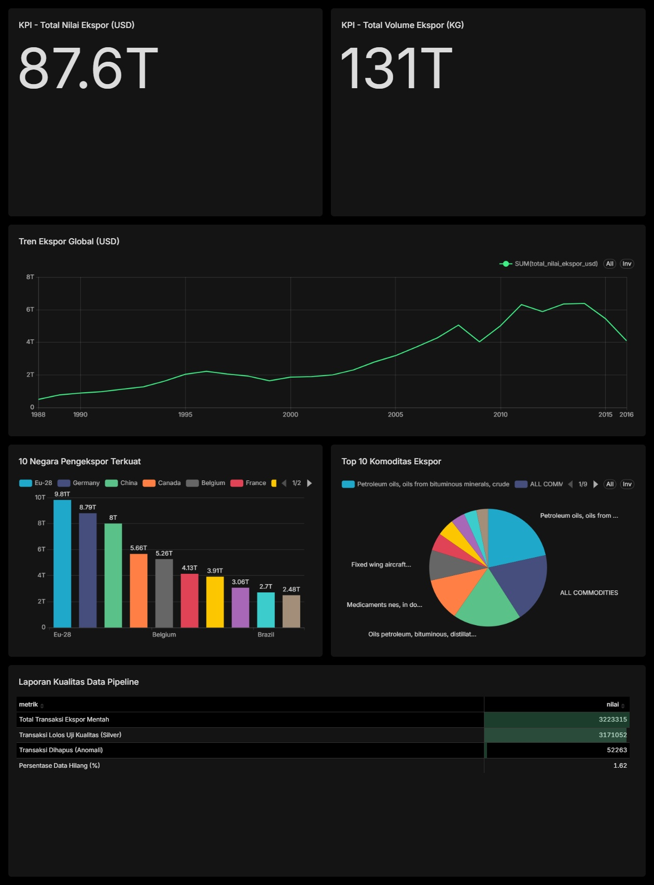

# Trade8 — SDG 8 Global Trade Pipeline

Trade8 is a reproducible data pipeline and interactive dashboard for exploring UN Comtrade commodity trade data from 1988–2016. It combines grain-safe Pandas/Spark ETL, a read-only Flask/SQLite API, and a responsive React dashboard with an interactive 3D motion hero and local vector world map.



## What is included

- Grain-safe macro indicators built only from `TOTAL / ALL COMMODITIES` rows.
- HS6 commodity rankings built only from detailed `Export` rows.
- Aggregate reporting regions excluded from country rankings.
- Annual-average growth comparisons that account for the incomplete 2010–2019 decade.
- Memory-conscious Pandas ETL and an equivalent Spark/Hive path.
- Small read-only Flask API backed by a pre-aggregated SQLite database.
- React/Vite dashboard with resilient partial loading, lazy-loaded local map, downloadable summary, and reduced-motion support.
- Automated API, pipeline, frontend, dependency, and Docker Compose checks in GitHub Actions.

## Data contract

The source CSV contains overlapping analytical grains. Trade8 keeps them separate:

| Indicator | Source grain | Flows | Exclusions |
| --- | --- | --- | --- |
| Annual trade and country ranking | `comm_code = TOTAL` | Export, Import | EU-28, World, Other Asia nes, SACU |
| Commodity and category ranking | HS detail (`comm_code != TOTAL`) | Export | TOTAL rows and mirror imports |

This prevents `ALL COMMODITIES` from being added to its own HS6 components. The generated database includes a `pipeline_metadata` table documenting its schema version, build time, row counts, and grain definitions.

## Architecture

```text
UN Comtrade CSV
      │
      ├── Pandas chunks ──> validated aggregates ──> SQLite ──> Flask API
      │                                                        │
      └── HDFS ──> Spark Silver ──> Parquet/Hive Gold          └── React/Vite
```

## Prerequisites

- Python 3.11 recommended
- Node.js `^20.19.0` or `>=22.12.0`
- Docker with Compose v2 for the optional Hadoop/Spark/Hive stack
- The Kaggle [UN Comtrade dataset](https://www.kaggle.com/datasets/unitednations/global-commodity-trade-statistics)

Place the extracted file at:

```text
data/commodity_trade_statistics_data.csv
```

## Local setup

Create a virtual environment and install the API plus Pandas ETL dependencies:

```bash
python -m venv .venv
# Windows: .venv\Scripts\activate
# macOS/Linux: source .venv/bin/activate
pip install -r dashboard/backend/requirements.txt -r requirements-etl.txt
```

Build the SQLite analytics database:

```bash
python dashboard/backend/data_pipeline.py
```

Start the API:

```bash
python dashboard/backend/app.py
```

In another terminal, start the dashboard:

```bash
cd dashboard/frontend
npm ci
npm run dev
```

Open `http://localhost:5173`.

Useful environment variables:

| Variable | Purpose | Default |
| --- | --- | --- |
| `TRADE8_DB_FILE` | Override the SQLite file used by the API | `dashboard/backend/trade_data.db` |
| `TRADE8_ALLOWED_ORIGINS` | Comma-separated development CORS origins | localhost Vite origins |
| `VITE_API_URL` | Override the frontend API base URL | `/api` in production |

## Pandas and Spark ETL

Run the memory-conscious Pandas Gold pipeline:

```bash
python src/etl_medallion_pandas.py
python src/cek_metrik.py --source pandas
```

For local PySpark, additionally install:

```bash
pip install -r requirements-spark.txt
```

For the containerized data platform:

```bash
docker compose config
docker compose up -d
docker cp data/commodity_trade_statistics_data.csv namenode:/tmp/trade_data.csv
docker exec namenode hdfs dfs -mkdir -p /data/bronze/trade
docker exec namenode hdfs dfs -put -f /tmp/trade_data.csv /data/bronze/trade/trade_data.csv
docker exec spark-master spark-submit --master spark://spark-master:7077 /opt/trade8/src/etl_medallion_spark.py
```

Spark UI is available on `http://localhost:8080`; HDFS NameNode UI is on `http://localhost:9870`.

## Verification

```bash
python -m unittest discover -s dashboard/backend/tests -v

cd dashboard/frontend
npm run lint
npm run build
npm audit --omit=dev

cd ../..
docker compose config --quiet
```

## API endpoints

- `/api/trade-by-year`
- `/api/top-countries`
- `/api/top-commodities`
- `/api/trade-by-category`
- `/api/all-countries-trade`
- `/api/growth-metrics`
- `/api/metadata`
- `/api/health`

Successful analytical responses are browser/CDN cacheable. The health endpoint validates the database and does not expose filesystem paths.

## Deployment

`vercel.json` builds the Vite frontend and Flask serverless function from this monorepo. After importing the repository in Vercel, ensure Deployment Protection is disabled for the production domain if the dashboard must be publicly accessible.

The repository's configured deployment URL is [sdg8-global-trade-pipeline-bkef3fx9x-nowell.vercel.app](https://sdg8-global-trade-pipeline-bkef3fx9x-nowell.vercel.app/). Its public accessibility depends on the Vercel project protection setting.

## Data source and SDG context

- [UN Comtrade](https://comtrade.un.org/)
- [UN Sustainable Development Goal 8](https://sdgs.un.org/goals/goal8)

Trade data is an indicator of economic activity, not a direct measurement of decent work. Interpret concentration and growth alongside labor, wage, productivity, and distributional indicators.
